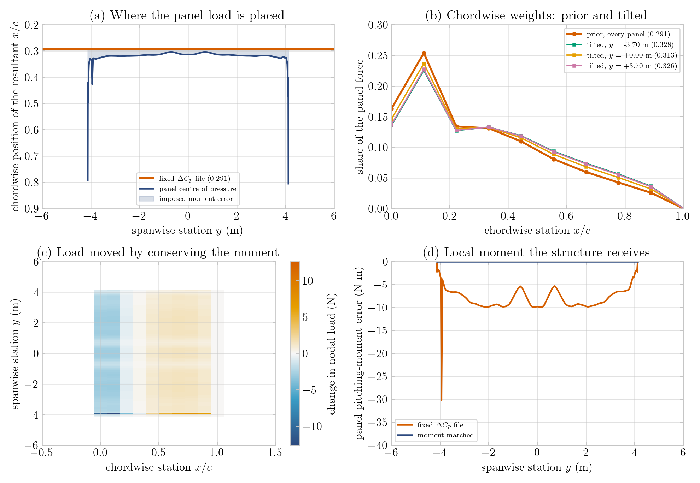
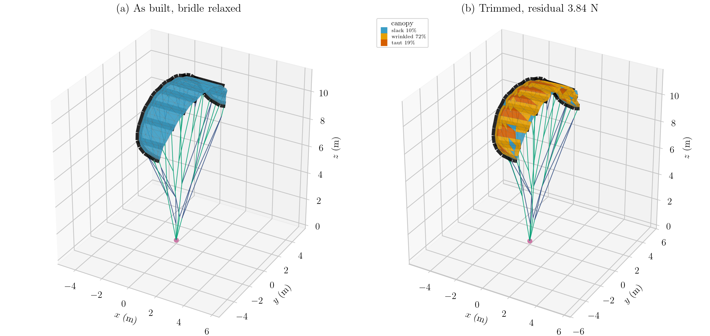
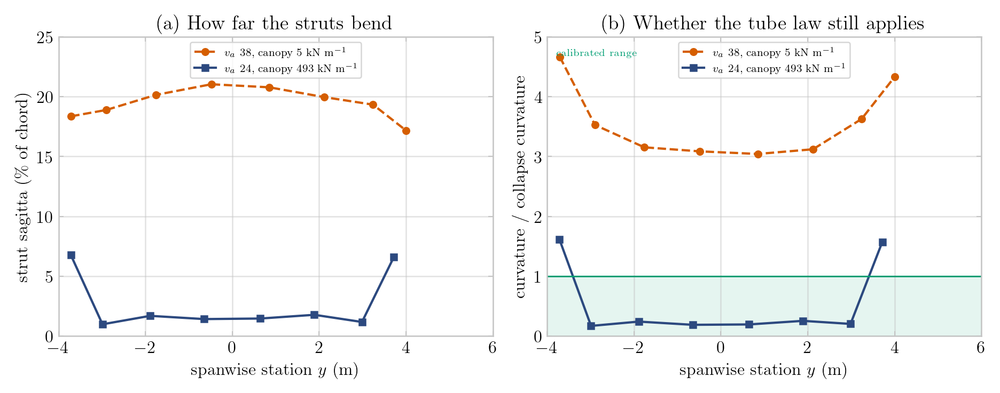
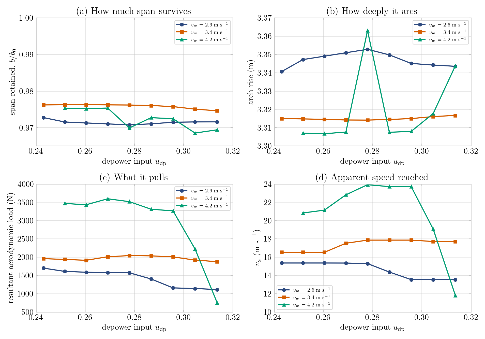

# Coupling Billow to the quasi-steady trim

**Status:** working, preliminary results below. Integrated 2026-09-11.

> A typeset PDF of this document, with the figures, is `integration.pdf`
> alongside it; rebuild with `latexmk -pdf integration.tex`.

`billow.pdf` (alongside this file) documents the standalone structural package:
the element library, the validation against closed-form benchmarks, and the
`kite_fem` comparison. This document covers the other half — how that package is
driven against the VSM quasi-steady trim, what had to change on both sides to
make the coupled answer physical, and what the first converged runs say.

---

## 1. Architecture

The coupling adds one module and reuses everything else.

```
aerostructural/
  fem/aerostructural_coupled_solver.py   the coupled loop, SHARED
  fem/read_struc_geometry_yaml.py        the geometry reader, SHARED
  fem/aero2struc.py                      the load mapping, SHARED
  aerodynamic_vsm.py                     the trim, SHARED
  billow/structural_billow.py            NEW -- the only new physics-facing code
scripts/aerostructural/
  run_simulation_BILLOW.py               NEW -- the driver script
```

The coupled solver in `fem/` is, despite its location, not FEM-specific: it
already dispatched on `config["structural_solver"]` between `pss` and
`kite_fem`. Adding Billow was a branch at each of seven dispatch points, not a
copy of its thousand lines. **Any future backend should do the same.**

`structural_billow.py` is the only module that imports both
`awetrim.structural` and the AWETrim schema. That boundary is deliberate and
load-bearing: the structural package stays free of PSS, VSM and YAML knowledge,
so its element physics can go on being validated against closed-form solutions
independently of anything the coupling does.

### The coupled loop

Unchanged from the FEM path except for step 7:

1. structural nodes → VSM leading/trailing edge points
2. `body_aero.update_from_points`, bridle-line drag segments rebuilt
3. VSM quasi-steady trim → panel forces, moments and the trim state
4. panel loads → structural nodes (`aero2struc`, §4)
5. inertial and gravity loads distributed by nodal mass
6. bridle line drag
7. **`structural_billow.run_billow`** → new node positions
8. Aitken relaxation on the node displacement
9. tape actuation, if any
10. convergence check

### Element mapping

`structural_billow.instantiate` consumes exactly the arrays
`read_struc_geometry_yaml.main` already returns, so one reader serves both
backends:

| reader element | Billow element | note |
|---|---|---|
| `inflatable_beam` | `InflatableBeamKernel` | diameter arrives in `k_arr`, pressure in `c_arr` — the reader's own convention |
| `pulley` arm pairs | `PulleyKernel` | rest length is the WHOLE rope; the reader stores that total on each arm |
| bridle `noncompressive` | `CableKernel` | tension-only |
| canopy grid springs | **dropped** | replaced by wrinkling CST membrane triangles on the same grid |

Replacing the canopy is the point of the exercise. The FEM canopy is a square
spring net with diagonals: too soft by `1 - nu` in tension, carrying shear only
as a fourth-order effect of the diagonal stretch, and with no notion of a
biaxial stress state at all. A relaxed (Pipkin) membrane carries the fabric's
real biaxial law and settles into a tension field rather than mesh-scale
crumple. Everything else — bridle, pulleys, tubes — is element-for-element the
same as the FEM model, so a Billow-versus-FEM difference is attributable to the
canopy and the solver formulation and to nothing else.

On `struc_geometry_FEM_full.yaml`: **268 nodes, 1098 DOF, 47 cables, 20
pulleys, 97 inflatable tube beams, 378 membrane triangles**, replacing 693
canopy springs. Build under a second; the structural solve costs ~2–5 s per
coupled iteration against ~8–25 s of VSM, so the structure is not the
bottleneck.

### Geometry

Billow requires `struc_geometry_FEM_full.yaml`. It is the only file in the repo
carrying `strut_tubes`, `leading_edge_tubes` and `pressure`; the reduced PSM
files are bridle-and-spring only and cannot feed beams or a canopy mesh.

That choice has a consequence worth stating plainly. FEM_full has 28
leading-edge nodes → 27 sections, so the reachable aero panel counts are
27 × n: **27, 54, 81, 135**. The wes-quasi-steady campaigns run 45 panels, but
that is 9 sections × 5 on the PSM geometry and is *not reachable here*. 54 is
the adopted default — nearest to 45 and above the 27/36/45 band `as_config`
records as mesh converged.

---

## 2. Three things that had to be true before the answer was physical

Each of these was found by looking at the converged shape and asking whether it
could be right. None of them is a solver bug; all three are modelling inputs
that were wrong or badly chosen, and all three were invisible in the FEM path.

### 2.1 The bridle is not in equilibrium as authored

The kite YAMLs store *measured* rest lengths against *measured* node positions,
and the two do not agree. On FEM_full, `Br_main_1` is 11.5% longer than the
distance between the nodes it joins — at the real `EA/l0` that is **88 kN in one
line**. Starting a coupled run there is starting it from an explosion.

`relax_bridles` settles the bridle onto the held wing before the model is
built: every wing grid node fixed, the KCU pulled down and then settled, the
whole structure re-centred. Peak cable tension 88 kN → 0.4 N. Because the wing
is held, the canopy and tube reference configurations are untouched up to a
rigid translation, which no reference strain can see.

This is the same role `structural_kite_fem.relaxbridles` plays on the FEM path.
**The consequence for callers: the nodes the coupled loop starts from are not
the raw YAML nodes.** Read them back from `structure.model.nodes`.

Related: the reader used to compute the bridle stiffness as `EA/l0` and then
discard it in favour of a hard-coded 5000 N/m — a bridle roughly 17× too soft.
Fixed; the PSS reader had always done it correctly.

### 2.2 Reference curvature breaks before the physics does

The beam's reference curvature is `omega_0 = psi / L0` with `psi` a Rodrigues
vector. It grows like `tan(theta/2)` and is singular at `theta = pi`, so a
*short* element bridging a *large* frame change is numerically hostile long
before it is physically wrong.

Seeding each member's roll independently — the obvious thing — put the worst
LEI-V3 element at **173 degrees, `omega_0 = 753 /m` on a 17 mm element**, which
is 7 degrees from the chart singularity.

The fix uses a property of the section rather than a numerical trick. An
inflated tube is isotropic in roll (`ga_2 == ga_3`, a single bending law), so
only `d1` is physically determined and the roll is entirely free. Spending it on
conditioning — transporting frames by minimal rotation over the beam tree, and
letting the *long* member own each leading-edge/strut joint
(`junction_frame="strut"`, since the LE runs are 300–750 mm and the strut stubs
17–97 mm) — gives **10.6 /m**, a factor of 71.

### 2.3 A gravity-only load case is not a smoke test

The KCU is pinned *below* the wing, so gravity alone slackens every bridle line
and the bridle knots become a mechanism. The residual then sits at exactly their
weight — 2.021 N on nodes 79 and 113 — and no amount of solver tuning moves it.

Billow reports this faithfully. `kite_fem` never shows it because its
`I_stiffness = 25` acts as a ground spring on every node, quietly holding
unsupported nodes up. **Read a stuck residual equal to some node's load as
"this node has no load path", not as a conditioning problem.** Load the wing
away from the KCU, as the aerodynamics does.

---

## 3. Two inputs that were wrong, and why they mattered more than expected

### 3.1 Apparent wind speed

`as_config`'s flight state is zero elevation, zero azimuth, 90° course, gravity
off — the *fastest corner of the wind window*. At 8 m/s wind and the trimmed
L/D of about 4.8 that is **v_a ≈ 38 m/s**, above the entire 13–25 m/s band the
wes-quasi-steady campaigns sweep.

For the FEM path this mattered less than it looks, because the campaigns argue
that coupled trims are v²-self-similar and correct for it. **That argument does
not survive the introduction of the tubes.** The inflatable bending law

```
M(kappa) = M_max * (1 - exp(-EI_0 * kappa / M_max))
```

*saturates*. Past `M_max` the tube has essentially no incremental bending
stiffness and hinges at constant moment — the compression-side wrinkling
collapse of a real inflated tube. Collapse is reported, not enforced, because a
dropping post-collapse moment would be an unbounded mechanism that energy
minimisation would simply run away from.

A saturating law has no self-similarity: the load decides whether the tubes are
inside their calibrated range at all. At v_a 38 every strut sat **3.0–4.7× past
its collapse curvature**, at 86–94% of `M_max`, and hinged into 17–21% of chord.

The run script therefore sets the wind so that v_a lands in the campaign band.
The campaigns iterate wind onto a target v_a with a ratio table; this is the
one-shot version of the same idea.

### 3.2 Canopy stiffness

The canopy was initially set to `E*t = 5000 N/m` to match the kite_fem spring
net, on the reasoning that it made the two canopies comparable. It made them
comparable *and both wrong*: at any plausible sailcloth thickness 5000 N/m is
**E ≈ 20 MPa**, which is rubber.

The real cloth is already described in the geometry file. `canopy_density: 170`
g/m² of polyester ripstop gives a solid-equivalent thickness of
`0.170 / 1380 = 123 µm`, and at a crimp-derated in-plane modulus of 4 GPa that
is **E*t ≈ 4.9e5 N/m — about a hundred times stiffer**.

A canopy that soft does not carry load; it billows, and drags the struts with
it. Measured on the same load case, strut sagitta ran 4.5–6.7% of chord at
5e3 N/m and 0.6–4.1% at 1e6 N/m.

> The modulus is a **material estimate, not a measurement**. The repository
> contains no tensile data for this cloth. The plausible range — 2–12 GPa fibre
> modulus, varying crimp derating — spans `E*t` from 2.5e5 to 1.5e6 N/m. A
> tensile test on the actual canopy would replace it, and should.

---

## 4. Chordwise load placement is the local pitching moment

Independent of Billow, but surfaced by it, and it changes the FEM path too.

`aero2struc` spreads each spanwise VSM panel force over ten chordwise nodes.
**Where it puts the resultant is the panel's local pitching moment**, and the
wing's trim is a moment balance — so this is a first-order modelling choice, not
a detail of interpolation.

The historical `cp_file` mode reads one measured `Delta C_p` shape from a
single-angle file and applies it to every panel at every angle of attack. Its
centroid on the LEI-V3 file is **0.291 c**. Measured on one trim at 135 panels,
the panels' actual centres of pressure — which VSM already computes from each
panel's own force and moment — run **0.303 to 0.805 c**. The fixed station
therefore imposes **917 N m** of spurious pitching moment, about **−10 N m on
nearly every panel, with the same sign**. A systematic bias is precisely what
shifts a moment balance; a random one would largely cancel.

`chordwise_distribution: moment_matched` keeps the measured shape as a prior and
tilts it onto each panel's own centre of pressure:

```
w_i  =  w0_i * exp(lambda * t_i) / sum_j w0_j * exp(lambda * t_j)
```

with `lambda` solved from `sum_i w_i t_i = t_cp`. Three properties make the
exponential tilt the right correction rather than, say, a least-squares one:
every weight stays strictly positive, so no unphysical negative patch of load
appears; the weights still sum to one, so the panel force is preserved exactly;
and `lambda` is the natural parameter of an exponential family, whose mean is
strictly increasing in it, so the root exists, is unique, and Newton converges
from zero. It is also the minimum-relative-entropy correction, so the measured
shape is kept wherever the moment does not contradict it.



*(a) the single fixed chordwise station the ΔC_p file imposes against each
panel's actual centre of pressure — the shaded gap is moment the structure
receives but the aerodynamics never produced; the excursions at y ≈ ±4 m are
the stalled tip panels. (b) prior and tilted weight sets. (c) the load the
correction moves. (d) the per-panel moment error, same sign on nearly every
panel, against zero for the matched weights.*

Residual moment error: **917 N m → 6e-9 N m.** The default stays `cp_file` so
stored results reproduce; the Billow script sets `moment_matched`.

**A warning about the diagnostic.** `check_moment_preservation` does *not*
measure any of the above. Both of its call sites hand it the already-distributed
loads, so it reports the error of the *spatial* nearest-node step alone. That
error is 0.09% on the built shape but around **20% once the kite has deformed** —
a separate and still-open defect. Do not quote its numbers as evidence about
the chordwise placement.

---

## 5. Preliminary results

LEI-V3, unactuated (the tape lengths the geometry stores: `depower_tape`
l0 = 1.9 m, i.e. u_dp ≈ 0.28), 54 aero panels, gravity off, moment-matched
chordwise loads.

### Convergence

| state | iterations | final residual |
|---|---|---|
| real canopy, v_a 24 | **2** | 3.84 N |
| soft canopy, v_a 38 | 7 | 4.33 N |
| soft canopy, v_a 38, 135 panels | 10 | 4.45 N |

Gate is 5 N absolute. The physically-correct case is also by far the easiest to
converge — worth noting, because a model driven outside its calibrated range
does not merely give a wrong answer, it costs more to get it.



*(a) the built shape after the bridle relaxation of §2.1, before any
aerodynamic load; (b) the trimmed shape, canopy shaded by the wrinkling state
the solver chose. Black: inflatable tubes at their real relative diameters.
Green: bridle cables. Blue: pulley ropes through their sheaves. Magenta: the
KCU, the only pinned node.*

### Span reduction

The headline structural result. Tip-to-tip is the straight distance between the
two leading-edge tips; LE arc is the length measured along the tube.

| | as built | trimmed | change |
|---|---|---|---|
| **tip-to-tip span** | 8.202 m | **7.959 m** | **−0.243 m, −2.96%** |
| leading-edge arc length | 12.662 m | 12.636 m | −0.026 m, −0.21% |
| arch rise above the tip chord | 3.282 m | 3.362 m | +2.42% |
| mean chord | 2.044 m | 2.036 m | −0.4% |

**The span reduces by 3.0%, and it does so by arcing, not by stretching.** The
leading-edge arc length is conserved to 0.2% — the tube neither extends nor
compresses — while the arch rise grows 2.4%. The wing bends into a deeper arc
under load and pulls its tips inward. That is the correct physical picture for a
leading-edge-inflatable kite, and it is a stringent check on the beam
formulation: an axially sloppy beam would have shown span loss through
shortening instead.

For contrast, the same kite with the soft canopy at v_a 38 gives the **wrong
sign**:

| | soft canopy, v_a 38 |
|---|---|
| tip-to-tip span | **+2.24%** |
| leading-edge arc | −0.02% |
| arch rise | −3.87% |
| mean chord | **−7.1%** |

A canopy at E = 20 MPa stretches instead of carrying load, so the sail draws the
trailing edge toward the leading edge (chord −7%) while the wing *flattens* and
splays its tips outward. Both the sign of the span change and the magnitude of
the chord change are unphysical. This is the clearest single argument for §3.2.

### Strut bending

Sagitta is the maximum perpendicular deviation from the straight line joining
the strut's two ends. Utilisation is curvature over the law's collapse
curvature; above 1.0 the tube is outside the range the ASKITE fits were
calibrated over.

| configuration | main struts (6) | outboard struts (2) |
|---|---|---|
| v_a 38, canopy 5 kN/m | 17–21% of chord, 3.0–4.7× | — |
| v_a 21, canopy 5 kN/m | 7.1–9.5%, 1.2–2.2× | — |
| **v_a 24, canopy 493 kN/m** | **1.0–1.8% (22–44 mm), 0.17–0.25×** | 6.6–6.8% (112–115 mm), 1.6× |

The six main struts are effectively straight — tens of millimetres over 2.2–2.6
m — and sit comfortably inside the calibrated range. This matters because real
LEI struts do not visibly bend in flight, and a model that bends them is wrong
whatever its residual says.

The two outboard struts remain past collapse. They are the thinnest
(0.080–0.106 m against 0.108–0.141 m) and the shortest, and they sit next to the
tip region where VSM reports stall, so they are where the inflation pressure
matters most. See §6.



*(a) sagitta as a fraction of chord; (b) curvature over the collapse curvature
of the fitted tube law, calibrated range shaded. At v_a 38 with the spring-net
canopy every strut is far outside the range the ASKITE fits cover. With the
real apparent speed and the real cloth the six main struts fall to a fifth of
collapse curvature; only the two thin outboard struts remain above 1.*

### Canopy state

Fraction of the 378 membrane triangles in each regime at the solved state:

| | slack | wrinkled | taut | resultant aero load |
|---|---|---|---|---|
| real canopy, v_a 24 | 9.5% | 72.0% | 18.5% | 3.57 kN |
| soft canopy, v_a 38 | 1.9% | 41.0% | 57.1% | 10.73 kN |

The realistic canopy is predominantly **wrinkled** — carrying tension in one
direction and none across it. That is the expected state for a sail: a genuine
tension field over most of the surface, going taut only where it is pulled
biaxially. The soft canopy at three times the load reads as mostly taut simply
because it has stretched far enough to carry biaxial tension everywhere, which
is what a rubber sheet would do.

This diagnostic has no counterpart in the spring-net canopy. A net has no
biaxial stress state and so cannot distinguish these cases at all.

---

### Depower sweep

Continuation chains either side of the built tape length, at three winds: 26
converged points over u_dp = 0.243–0.314, in 19 minutes. Each chain walks the
tape inside a single coupled call so every step warm-starts the next; solving
each point independently was measured at 14 minutes *per point*.



*Each curve is one wind speed; within a chain the wind is held, so v_a slides
with u_dp and (d) is a readout rather than a control. (a) span retained against
the as-built 8.202 m. (b) arch rise — the outlier at u_dp 0.278 is the built
point, the only step without a warm start. (c) resultant aerodynamic load. The
v_w = 4.2 curve leaves the attached branch past u_dp ≈ 0.30 in both (c) and (d).*

**Span loss is nearly invariant over the box** — 96.9% to 97.6% retained
everywhere. Depowering by 0.07 in u_dp and nearly doubling the wind barely move
it, so the 2.96% above is the wing's signature across this operating box rather
than a property of one trim point.

**What depower controls is load, not shape.** The resultant aerodynamic force
falls 29% at v_w 2.6 and 35% at 3.4 across the u_dp range, against about 0.5% of
span movement. At least this far from stall, the depower tape is a load knob.

Three caveats, all visible in the figure and none yet resolved:

1. **The highest-wind chain leaves the attached branch** past u_dp ≈ 0.30: load
   3263 → 751 N, v_a 23.7 → 11.8 m/s. At u_dp 0.314 the highest wind pulls
   *less* than the lowest — deep stall, not depower. Wants the attached-branch
   guard the campaign scripts use.
2. **The built point of each chain is under-converged**, being the one step with
   no warm start (4.11 N against ~2 N); it is the arch-rise outlier in (b).
   Chain structure, not physics.
3. **Span is not monotonic in wind** — 2.6 loses more span than 3.4.
   Unexplained; may be caveat 2 leaking in.

The flat v_a segments in (d) are `quasi_steady_trim.max_nfev: 8` — the
warm-started trim returns a bit-identical `opt_x` when it starts inside
tolerance. Harmless, but v_a per step is not independently converged.

## 8. Mirror symmetry

An unactuated kite at the centre of the wind window with gravity off is
mirror-symmetric in every input, so its solved shape must be mirror-symmetric
too. It was not. Chasing that found three independent causes, two of them fixed.

### 8.1 The geometry was asymmetric before any solve

Two slips in the shared canopy-section interpolation
(`fem/read_struc_geometry_yaml.py`), both of the same kind — a quantity measured
one way divided by a quantity measured another:

* `ratio_te` took the **leading-edge** distance over the **trailing-edge**
  length. That is a fraction only when the two runs happen to be equal. Under
  `y -> -y` the LE distance becomes its complement while the TE length does not,
  so a section and its mirror got blend weights that did not sum to one. Worst
  where the bounding struts differ most — a 0.35 m tip chord beside a 1.7 m
  strut — which is exactly where the error showed.
* Both ratios divided a **straight-line distance** by an **arc length**. On a
  curved edge the two chords from either bounding strut do not add up to the arc
  between them, so the same complement argument fails again.

Built-geometry mirror mismatch: **171.73 mm → 0.000000 mm**. The leading and
trailing edges themselves were always exact; it was only the interpolated
interior. This function is shared, so the FEM and PSS paths were affected too.

### 8.2 The canopy triangulation was not mirror-symmetric

Raised by Roland Schmehl in review. Splitting every quad along the *same*
diagonal is directionally biased, and under `y -> -y` that diagonal maps to the
other one, so the mesh is not mirror-symmetric. On a finely resolved mesh the
bias is small; here the quads are a sizeable fraction of the wing.

Measured from the now-exactly-symmetric geometry, the solve generated
**3.5–21 mm** of left-right mismatch. (These were taken with Anderson
still active and overstate the canopy's share — see §8.5 for the clean
attribution.) The distribution confirms the mechanism:
the mismatch is largest on the **pure-canopy** sections (14–21 mm) and smallest
on the **strut-stiffened** ones (~4 mm) — it appears where the membrane governs
and is suppressed where a beam carries the load.

`canopy_mesh` now offers three patterns:

| pattern | triangles per quad | extra nodes | mirror-symmetric | can a quad dome? |
|---|---|---|---|---|
| `diagonal` | 2, one diagonal | 0 | no | no |
| `union` | 2+2, superposed at half `E t` | 0 | yes | no |
| `cross` | 4, via a quad-centre node | 1 per quad | yes | **yes** |

`union` is an **overlay, not a subdivision**, and the distinction matters. You
cannot cut a quad into four triangles with both diagonals — on a non-planar quad
the diagonals do not even intersect, and that is precisely what a centre node is
for. What `union` does instead is lay the two possible 2-triangle
triangulations, `(abc, acd)` and `(abd, bcd)`, on top of each other, each
carrying half the stress resultant. The quad is covered twice, by two
independent sheets, and the two diagonals never meet.

Two consequences follow, and both are why it is a control rather than a
recommendation:

- A quad need not be planar, and on a non-planar quad the two triangulations
  describe **two different surfaces**. The patch is then modelled as two
  interpenetrating half-stiffness sheets rather than as one surface.
- It still **cannot dome**. Every triangle has all three corners on the quad
  corners, so the patch has no interior freedom, and superposing two fold-only
  surfaces gives a fold-only patch.

Its one virtue is what it was built for: it is exactly mirror-symmetric (the
reflection maps one triangulation onto the other) at zero added DOF, so it
separates the diagonal bias from the DOF count in the A/B below. `cross` changes
both at once.

All three store identical energy under a uniform stretch (71.134618 J at 1%,
1849.850446 J at 5%) — verified, and it caught `union` being 2x too stiff before
the stress resultant rather than the thickness was scaled.

`cross` is Roland's proposal and is the only one that gives a patch the freedom a
billowing sail needs: a two-triangle quad can only *fold* along its diagonal, it
cannot bulge. It is **not yet fairly tested**, because its centre nodes are
massless and receive no direct aerodynamic load — the aero-to-structure mapping
targets grid nodes only — so they are held by the membrane alone. Extending the
load mapping to them is the outstanding work.

### 8.3 What remained was aerodynamic

On an exactly symmetric wing the spanwise resultant must be zero. This needs no
panel pairing to check, so it is immune to indexing mistakes:

| gamma loop | `allowed_error` | `F_y` | per-panel mirror error |
|---|---|---|---|
| `base` (relaxed Picard) | 1e-8 | **0.00000 N** | **3.4e-07 N** |
| `anderson` | 1e-6 | -11.079 N | — |
| `anderson` | 1e-8 | -0.7125 N | 1.8e-01 N |
| `anderson` | 1e-10 | -1.2337 N | — |

**Anderson acceleration breaks the mirror symmetry of the circulation solve**,
by five and a half orders of magnitude, and tightening the tolerance makes it
*worse*. It is symmetry-equivariant in exact arithmetic, so the mechanism is
almost certainly its ill-conditioned least-squares amplifying roundoff-level
asymmetry; the tolerance signature fits, since tighter convergence makes the
residual-difference columns more degenerate. This is not local to Billow —
`as_config` ships `anderson` and every wes-quasi-steady campaign passes it.

Coupled effect on the unsteered case:

| configuration | left-right mismatch |
|---|---|
| diagonal mesh, anderson | 118.9 mm |
| symmetric mesh, anderson | 55.7 mm |
| symmetric mesh, **base** | **28.2 mm** |

The base loop was also **faster end to end** here — 64 s against 144 s, two
coupled iterations against seven — because it gives the outer loop a smoother
map. An earlier "6x slower" figure was measured at a much higher load and does
not generalise. The gamma loop alone also moves the span by 51 mm (0.6%), so
this is not only a symmetry question.

### 8.4 The remaining 28 mm is unresolved

Both the geometry and the canopy mesh are now provably symmetric, and the
aerodynamics is symmetric when `base` is used, yet 28.2 mm remains. It is **not**
convergence error: tightening the coupled gate from 5 N to 0.5 N made it larger,
not smaller.

One observation, offered as an observation rather than a cause: **12.4% of
mirror-paired canopy triangles (94 of 756) disagree on their wrinkling regime**,
with 59 elements within 1e-4 of the branch discriminant. The relaxed Pipkin
energy is continuous across those branches by construction, so this is most
likely a readout of the shape difference rather than its origin.

The natural next test — does the mirrored configuration have the same energy, in
which case the minimum is nearly degenerate and the solver is picking an
arbitrary point in a flat valley — was attempted and **abandoned as
unreliable**. Reconstructing a coupled state after the fact proved harder than
it looks: a geometrically exact beam's energy depends on positions *and* frames
together, and the saved pair was inconsistent because Aitken relaxation moves the
positions after the solve. `sim_output.h5` now stores `solved_positions`
alongside `frames` as a consistent pair for exactly this reason.

If the question is taken up again, the diagnostics should be computed **inside**
`run_billow`, where the state is consistent by construction, rather than
rebuilt from a saved file.

Whether it is worth taking up is a fair question: 28 mm is 0.35% of span, on a
model whose canopy modulus is uncertain by a factor of three (§3.2) and whose
strut inflation pressure is unverified (§6).

### 8.5 Attribution, measured cleanly

The figures in 8.2 were taken with Anderson still active, which **overstates the
canopy's share**. Re-measured with everything else symmetric -- fixed geometry,
`base` circulation loop -- and all three patterns at a matched 0.5 N gate:

| pattern | nodes | DOF | triangles | mismatch | residual | iterations |
|---|---|---|---|---|---|---|
| `diagonal` | 268 | 1098 | 378 | 34.70 mm | 0.47 N | 2 |
| `union` | 268 | 1098 | 756 | **28.17 mm** (-18.8%) | 0.46 N | 2 |
| `cross` | 457 | 1665 | 756 | 31.84 mm (-8.2%) | **0.13 N** | 5 |

So the honest ordering is:

* **Anderson dominates.** On the diagonal mesh it alone accounts for
  118.9 -> 34.7 mm.
* **The canopy diagonal is a real but secondary effect**, about 6.5 mm once the
  aerodynamics is symmetric, not the ~63 mm that 8.2 implies.
* **28 mm remains** whatever the mesh.

Two things worth noting about `cross`. It is *not* better than `union` on
symmetry despite both meshes being exactly mirror-symmetric -- most likely
because its centre nodes carry no direct aerodynamic load and are held by the
membrane alone. But it converges markedly tighter (0.13 N against 0.46 N),
consistent with the extra freedom being real: a quad that can dome has a
lower-energy state available to it than one that can only fold.

## 6. Open items

Roughly in priority order.

1. **Strut inflation pressure.** `struc_geometry_FEM_full.yaml` records
   `pressure: 0.3` bar, which sets both `M_max` and `EI_0` through the ASKITE
   fits. The two outboard struts are still 1.6× past collapse, and being the
   thinnest they are the most pressure-sensitive members on the kite. The real
   V3 operating pressure should be confirmed and the fits re-evaluated at it.
2. **Canopy modulus is an estimate.** See §3.2. Its plausible range is roughly
   ±3×, and §5 shows the answer is sensitive to it — including the *sign* of
   the span change at the soft end.
3. **The spatial load mapping loses moment.** `map_aero_forces_to_struct_nodes`
   drops ~20% of the applied moment once the kite has deformed (§4). The
   chordwise placement is now exact; this step is not.
4. **Tube axial and shear stiffness are derived, not fitted.** The ASKITE fits
   cover bending and torsion only. `EA` and `kappa G A` are currently read off
   the same fits' initial slopes as a modulus over the thin-wall section. This
   is defensible and not a sensitive quantity — an inflated tube is far stiffer
   in extension than in bending — but it is an assumption.
5. **The stiffness ladder is untested end to end.** `set_stiffnesses` exists and
   is unit-tested, but no coupled run has yet used a stiffness continuation
   ramp the way the PSS path does.
6. **Steering and depower actuation are wired but unexercised.** `set_rest_length`
   reaches the tape parameters and the driver branch calls it, but every run so
   far has been unactuated.

## 7. Running it

```bash
python scripts/aerostructural/run_simulation_BILLOW.py
```

Results land in `results/<kite>/aerostructural/billow/<case>/` as
`sim_output.h5` plus the deformed structural and aerodynamic geometry YAMLs.
Note that the results directory is keyed on actuation only and is **overwritten**
between runs that differ in anything else — copy a run aside before changing
panel count, wind or canopy stiffness.

Numerics live in the `structural_billow` block of `as_config.yaml`; every key
is listed with its default in `structural_billow.DEFAULTS`, and unknown keys
are rejected rather than ignored.

Two diagnostics:

```bash
python scripts/aerostructural/plot_billow_geometry.py            # 3-D shape, canopy by regime
python scripts/aerostructural/plot_chordwise_moment_matching.py  # §4, before and after
```

A depower sweep is a pair of continuation chains per wind:

```bash
python scripts/aerostructural/run_chain_depower_BILLOW.py --wind 2.6 3.4 4.2
python scripts/aerostructural/plot_billow_depower_chains.py
```

That writes `chains.csv` and one `sim_output.h5` per chain under
`results/<kite>/aerostructural/billow_depower_chains/`. Each row carries a
`converged` flag: a step that missed the residual gate is recorded rather than
dropped, so a short chain cannot read as a complete one.
`run_sweep_depower_BILLOW.py` solves each point independently and iterates the
wind onto a target apparent speed instead — about twenty times more expensive,
worth it only when a few points must sit at an exact v_a.

`sim_output.h5` now stores the nodal material frames alongside the positions
(`setup_tracking_arrays(..., with_frames=True)`). A geometrically exact beam's
curvature lives in the frames, not in the node positions, so without them a
saved run cannot afterwards be asked how bent its tubes were or whether they had
passed collapse — which is exactly the question §5 turns on.
