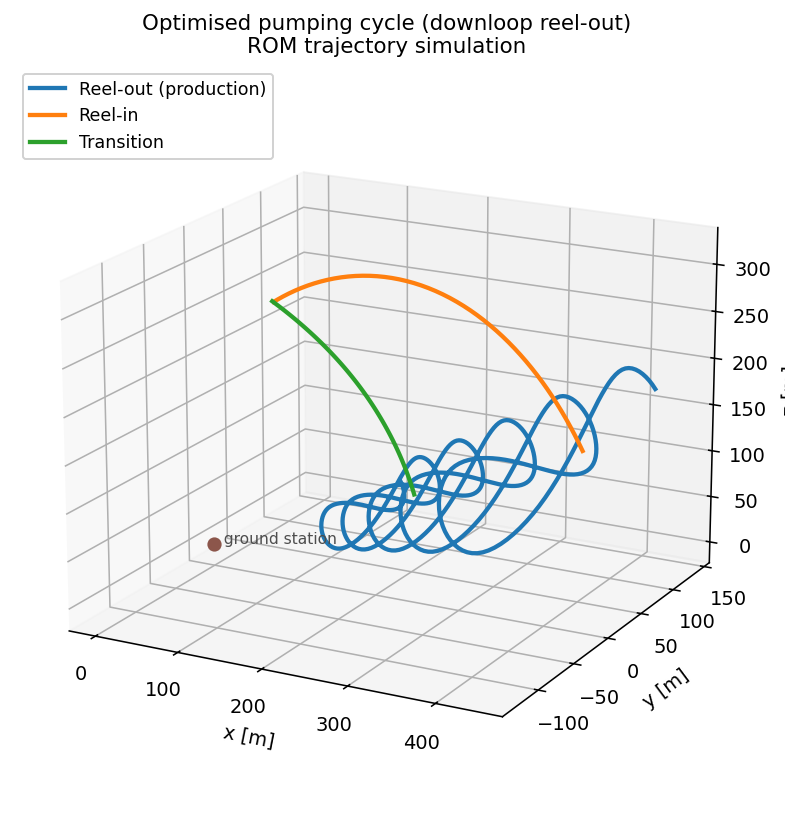

# Reduced-order model (ROM) scripts

The ROM is the fast, CasADi quasi-steady kite model fitted from aerostructural
sweeps (coefficients defined in each kite's `rom_config.yaml`). These scripts use
it to **simulate and optimise trajectories** and to **validate** the model
against flight data. Run everything from the project root.

System properties come from `data/<kite>/system.yaml`; trajectory/pattern
parameters from `data/<kite>/cycle_configs/*.yaml`. The path patterns themselves
(B-splines, uploop/downloop/helix) live in
`awetrim.kinematics.parametrized_patterns`.

## `optimization/`

### `optimization/reelout/` — single reel-out (production) patterns

| Script | What it does |
|--------|--------------|
| [`downloop_pattern.py`](optimization/reelout/downloop_pattern.py) | Simulate a periodic-spline **downloop** production loop from `cycle_configs/downloop_spline.yaml`. |
| [`uploop_pattern.py`](optimization/reelout/uploop_pattern.py) | Same for an **uploop** pattern. |
| [`helix_pattern.py`](optimization/reelout/helix_pattern.py) | Same for a **helix** pattern. |
| [`generate_spline_config.py`](optimization/reelout/generate_spline_config.py) | Generate a reel-out periodic-B-spline cycle config from a simple named initial curve (writes the YAML; does not simulate). |

Each pattern script builds a `Phase`, simulates the loop, saves the timeseries
(JSON) and produces trajectory/power plots.

### `optimization/reelin/` — reel-in

| Script | What it does |
|--------|--------------|
| [`simple_reelin.py`](optimization/reelin/simple_reelin.py) | Build a `ReelinSimple` (pure reel-in followed by the transition back to reel-out), simulate it, then optimise a small parameter set (e.g. transition start elevation) with the end radius constrained to its target. `--plot` to show figures. |

### `optimization/cycle/` — full pumping cycle

| Script | What it does |
|--------|--------------|
| [`run_cycle_simulation.py`](optimization/cycle/run_cycle_simulation.py) | Stitch a reel-out `Phase` + `ReelinSimple` into a full `CycleSimple` pumping cycle. Flags: `--shape {downloop,uploop,helix}`, `--plot`, `--figures N`, and `--optimize` with `--method {alternating,monolithic}` to maximise cycle power over the path and control parameters (CasADi Opti / IPOPT). |
| [`fit_periodic_cycle_config.py`](optimization/cycle/fit_periodic_cycle_config.py) | Generate a trim-feasible **seed** for the full-cycle optimisation: one periodic B-spline over the whole cycle (figure-eights + reel-in lobe), a synthetic depower profile and a flight-regressed winch law with a depower-dependent offset. `--kite K` picks a kite folder under `data/` (or any path to one); see *Running a full cycle for your own kite* below. `--loops N` sets the visible half-figures, `--auto` tunes the shape until the seed trims and closes at the profile's wind. `--reelin dubins --loops N` designs the reel-in instead of fading the figures out: bounded-curvature Dubins paths on the sphere from the peel-off to a level apex at `beta_reelin_peak` and down to a tangential landing (arcs 60 m, tightening to the profile's `min_turn_radius` only where that saves a detour loop); combine with `--close`. |
| [`run_full_cycle_opti.py`](optimization/cycle/run_full_cycle_opti.py) | Optimise the whole cycle as ONE periodic phase (path + per-node depower profile + free reel speed within the drum envelope) for cycle-average power, staged with a proximal trust region; `--kite` as above, `--no-optimize` only forward-simulates the seed (the flown-settings baseline). Writes seed-vs-optimised figures and a metrics table via [`cycle_comparison_plots.py`](optimization/cycle/cycle_comparison_plots.py). |
| [`report_cycle_optimisation.py`](optimization/cycle/report_cycle_optimisation.py) | Figures, tables and numbers of the method note [`docs/cycle_optimisation/cycle_optimisation.tex`](../../docs/cycle_optimisation/cycle_optimisation.tex) (transcription, seed generation, staging): method figures from the kite's profile, plus `--run LABEL=KITE_DIR` seeds and an `--archived` optimum. |

### Running a full cycle for your own kite

The full-cycle scripts read everything about a kite from one folder
(`data/<kite>/` or any path given to `--kite`); nothing is kite-specific in
code, so the folder can stay outside the repository.

| File | What the cycle needs from it |
|------|------------------------------|
| `system.yaml` | Mass, tether, the drum envelope (`drums[0]`: reel speeds, acceleration, `max_tether_force`) and the KCU actuator ranges/rates. |
| ROM config (`system.yaml` `models.reduced_order.aerodynamics`, else `rom_config.yaml`) | The ROM coefficients plus `controls.input_depower: {powered, depowered}` (**required**: the depower band in the ROM's own `u_p` unit) and, optionally, `validity.angle_of_attack_deg: [lo, hi]` (the AoA range the ROM was identified on; replaces the default AoA bound). |
| `cycle_profile.yaml` | **Required** `wind`, `winch_law` (the force law the seed's forward simulation marches with) and `seed` (`r0`, the cycle-duration prior and the pattern size: `reelout_fraction`, `beta0`, `beta_amp0`, `az_amp0`, `beta_reelin_peak`); optional `m_per_second`, `min_turn_radius` and a reference `flight`. [`data/LEI-V3-KITE/cycle_profile.yaml`](../../data/LEI-V3-KITE/cycle_profile.yaml) is the annotated example. |

Missing required entries and unknown keys raise instead of falling back on
the V3's numbers. Then:

```bash
python scripts/reduced-order-model/optimization/cycle/fit_periodic_cycle_config.py --kite path/to/MY-KITE --auto
python scripts/reduced-order-model/optimization/cycle/run_full_cycle_opti.py --kite path/to/MY-KITE
```

The seed is written to `<kite>/cycle_configs/`, results to
`results/<kite folder name>/optimization/full_cycle/`.

## `validation/` — against flight data

Both validators reproduce a specific flight, so they use the **as-flown** KCU
mass (`LEI_V3_SYSTEM_FLOWN_CONFIG`).

| Script | What it does |
|--------|--------------|
| [`validate_quasi_steady_state_v3.py`](validation/validate_quasi_steady_state_v3.py) | Take measured kinematics + wind as given and solve the quasi-steady force balance for tether force, steering input and tangential speed; compare predicted vs. measured. Can run rigid / flexible-lumped / `WilliamsTether` variants. |
| [`validate_spline_v3.py`](validation/validate_spline_v3.py) | Fit B-spline patterns to measured trajectories cycle-by-cycle, simulate them with the ROM and compare against the flight data. |

## Example outputs

 

*Left: `optimization/cycle/run_cycle_simulation.py` — downloop reel-out (blue), reel-in (orange) and transition (green). Right: `optimization/reelout/generate_spline_config.py` — periodic B-spline pattern in the (φ, β) plane.*

## Notes

- ROM aero parameters are calibrated/identified by the
  [`identification/`](../identification/) scripts; the coefficient definitions
  live in the ROM config the kite's `system.yaml` selects (LEI-V3:
  `rom_config_aerostructural_flight_corrected.yaml` by default, or
  `rom_config_aerostructural.yaml`; the paper's semi-empirical ROM was removed
  2026-10-07 and is archived in git history). The depower input the ROM was identified on is a
  per-kite convention (V3: power-tape length in metres; a kite logging a
  normalised signal uses that) declared in that file's `controls.input_depower` block and read by
  `awetrim.identification.controls.rom_depower_band`; the cycle scripts express
  every depower profile in the kite's own unit.
- Optimisation-variable bounds are centralised in
  `src/awetrim/utils/defaults.py` (`DEFAULT_OPTI_LIMITS`) — add new variables
  there, not inline. Physics traces to Cayon, van Deursen & Schmehl (2026) *WES*
  and the trajectory-optimisation abstract; see the project `AGENTS.md`.
